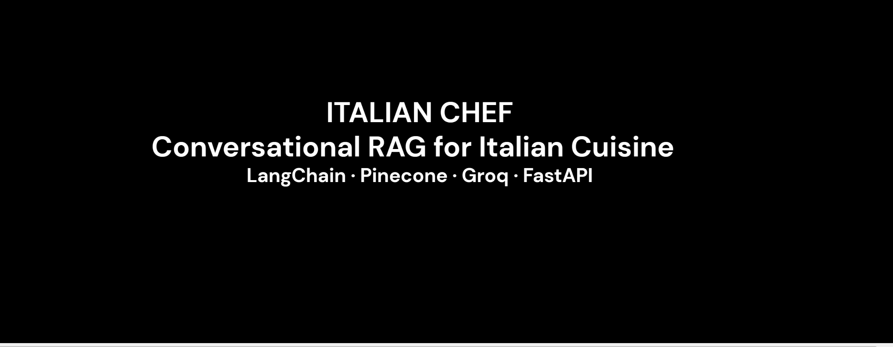
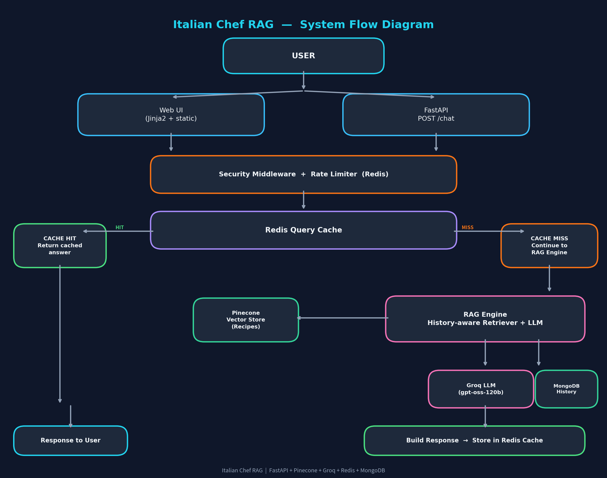

# 🍝 Italian Chef RAG

> **A conversational AI chef built with Retrieval-Augmented Generation (RAG), semantic recipe retrieval, conversation context, and modern API infrastructure.**

Italian Chef RAG is an AI-powered conversational recipe assistant designed to answer questions about Italian cooking using a retrieval-augmented architecture.

Instead of relying only on the language model's internal knowledge, the application retrieves relevant recipe information and uses that context to generate a more grounded response.

The project combines a user-facing chat experience with a developer-oriented backend that includes API documentation, health monitoring, and application metrics.

---

[](https://youtu.be/uxUMuLTFJiY)

-------

## ✨ What It Does

Italian Chef RAG lets users interact with an AI chef through natural language.

For example:

> **User:** How do I make authentic carbonara?

The system can:

1. Understand the user's question.
2. Use conversation history when interpreting follow-up questions.
3. Retrieve relevant recipe information.
4. Provide that retrieved context to the language model.
5. Generate a contextual answer.
6. Continue the conversation without requiring the user to repeat the entire context.

The application also exposes developer-facing functionality for interacting with and monitoring the backend.

---

## 🧠 Why RAG?

A standard LLM response is generated primarily from the model's learned knowledge.

A RAG system adds an additional retrieval stage:

```text
User Question
      │
      ▼
Question Understanding
      │
      ▼
Semantic Retrieval
      │
      ▼
Relevant Recipe Context
      │
      ▼
LLM Generation
      │
      ▼
Grounded Answer
```

For Italian Chef RAG, recipe information is represented as searchable vector data and retrieved when relevant to the user's question.

This allows the application to combine:

* user questions
* conversation history
* retrieved recipe context
* language-model generation

into a single conversational workflow.

---

# 🏗️ Architecture

At a high level, the system follows this flow:




# 🔄 RAG Pipeline

The core conversational flow can be summarized as:

```text
QUESTION
   +
CONVERSATION HISTORY
        │
        ▼
HISTORY-AWARE RETRIEVAL
        │
        ▼
SEMANTIC SEARCH
        │
        ▼
RELEVANT RECIPE CONTEXT
        │
        ▼
LLM GENERATION
        │
        ▼
GROUNDED RESPONSE
```

### 1. User question

The user asks a natural-language cooking question.

Example:

```text
How do I make authentic carbonara?
```

### 2. Conversational context

Follow-up questions can rely on the existing conversation.

Example:

```text
What about the cheese?
```

The system can interpret the follow-up in the context of the previous discussion.

### 3. Retrieval

Relevant recipe information is retrieved from the vector database.

### 4. Context augmentation

The retrieved information is provided to the language model as additional context.

### 5. Generation

The LLM generates the final conversational answer.

---

# 🔎 Retrieval Layer

The project uses Pinecone as the vector database for semantic retrieval.

Conceptually:

```text
Recipe Data
    │
    ▼
Embeddings
    │
    ▼
Pinecone
    │
    ▼
Semantic Search
    │
    ▼
Relevant Recipe Chunks
```

The retrieval stage allows the application to search for recipe information based on semantic meaning rather than relying only on exact keyword matches.

---

# 🤖 AI / Generation Layer

The project uses LangChain components to connect the retrieval workflow with the language model layer.

The generation flow combines:

```text
User Question
       +
Conversation History
       +
Retrieved Recipe Context
       │
       ▼
     Groq
       │
       ▼
Llama Model
       │
       ▼
Final Answer
```

The exact model/provider configuration is controlled by the application's configuration and environment setup.

---

# 🧩 Developer Experience

Italian Chef RAG is not limited to the chat interface.

The application also exposes developer-facing functionality through its backend.

## 📖 API Documentation

The application includes an API layer that can be explored through its documentation interface.

The repository is built around FastAPI/Uvicorn for serving the application.

When running locally, use the API documentation exposed by the application to inspect the available routes and schemas.

Typical development access:

```text
http://localhost:5000
```

The exact documentation route should be taken from the running application's API configuration.

---

## 💚 Health

The application includes a health/status surface intended to make it easier to verify that the service is running.

This is useful for:

* local development
* deployment checks
* service monitoring
* debugging
* operational verification

Use the application's visible **💚 Health** link or the corresponding health endpoint exposed by the API.

---

## 📊 Metrics / Observability

The current dependency set includes `prometheus-client`, indicating that the backend includes infrastructure for application metrics.

The application's **📊** surface can be used to inspect the observability/metrics functionality exposed by the running system.

This gives the project a developer/operations layer in addition to the conversational UI.

---

# 🛠️ Technology Stack

| Technology            | Role                                 |
| --------------------- | ------------------------------------ |
| **Python**            | Application language                 |
| **FastAPI**           | API/application framework            |
| **Uvicorn**           | ASGI server                          |
| **LangChain**         | RAG and LLM orchestration            |
| **Pinecone**          | Vector database / semantic retrieval |
| **Groq**              | LLM inference                        |
| **Llama**             | Language model                       |
| **Redis**             | Supporting infrastructure            |
| **Prometheus Client** | Application metrics                  |
| **Jinja2**            | Server-side HTML templating          |
| **Pydantic**          | Data validation                      |

The current repository's dependency list confirms the FastAPI/Uvicorn, LangChain, Pinecone, Redis, Prometheus, Jinja2, and Pydantic components.

---

# 📁 Project Structure

The current repository is organized into application, API, service, middleware, model, and frontend layers.

```text
italian-chef-rag/
│
├── api/
│   └── API routes and interfaces
│
├── core/
│   └── Application/core configuration and infrastructure
│
├── middleware/
│   └── Application middleware
│
├── models/
│   └── Application data models
│
├── services/
│   └── Business logic and RAG services
│
├── static/
│   └── Frontend static assets
│
├── templates/
│   └── HTML templates
│
├── app.py
│   └── Application/server entry point
│
├── bot.py
│   └── ChefBot initialization
│
├── dockerfile
│   └── Container configuration
│
└── requirements.txt
    └── Python dependencies
```

The repository currently contains these top-level application areas and entry points.

---

# 🚀 Getting Started

## 1. Clone the repository

```bash
git clone https://github.com/aae-ai/italian-chef-rag.git
cd italian-chef-rag
```

## 2. Create a virtual environment

### Linux / macOS

```bash
python3 -m venv .venv
source .venv/bin/activate
```

### Windows

```powershell
python -m venv .venv
.venv\Scripts\activate
```

---

## 3. Install dependencies

```bash
pip install -r requirements.txt
```

The repository currently uses FastAPI and Uvicorn as the application/server layer, alongside LangChain, Pinecone, Groq integration, Redis, and Prometheus-related dependencies.

---

# 🔐 Configuration

Create a local environment file according to the configuration expected by the application.

Typical secrets/configuration include credentials for external AI and vector services.

For example:

```env
PINECONE_API_KEY=your_pinecone_api_key
GROQ_API_KEY=your_groq_api_key
```

Do **not** commit real API keys or credentials to GitHub.

Use environment variables or a local `.env` file that is excluded from version control.

---

# ▶️ Running the Application

The repository's `app.py` creates the application and starts Uvicorn on port `5000` when executed directly.

Run:

```bash
python app.py
```

The application starts on:

```text
http://localhost:5000
```

The server entry point initializes the application through the project's core application factory.

---

# 🐳 Docker

The repository also includes a Dockerfile:

```text
dockerfile
```

This provides a containerization path for running the application in a reproducible environment.

A typical workflow is:

```bash
docker build -t italian-chef-rag .
```

Then run the image using the environment configuration required by the application.

---

# 🧪 Testing & Verification

For local verification, test the system in layers.

## Application

Open:

```text
http://localhost:5000
```

Confirm that the Italian Chef interface loads.

## Chat

Test a simple question:

```text
How do I make authentic carbonara?
```

Then test a contextual follow-up:

```text
What about the cheese?
```

Then:

```text
Can I make it for 4 people?
```

## API

Open the application's API documentation from the **📖 API Docs** link and verify that the expected routes are available.

## Health

Open the **💚 Health** link and confirm that the application reports the expected status.

## Metrics

Open the **📊** interface and confirm that the application's metrics/observability surface is responding.

---

# 🔐 Security Notes

Before deploying publicly:

* Never commit API keys.
* Keep secrets in environment variables.
* Review exposed API routes.
* Consider authentication/authorization for sensitive endpoints.
* Restrict administrative or operational endpoints where appropriate.
* Avoid exposing internal infrastructure details unnecessarily.
* Configure production CORS appropriately.
* Use HTTPS in production.
* Review logging to ensure secrets are not written to logs.

---

# ⚠️ Current Limitations

This project is primarily a demonstration and development-oriented RAG application.

Depending on the deployment configuration, additional production hardening may be required, including:

* authentication
* authorization
* rate limiting
* persistent conversation storage
* automated testing
* production observability
* error tracking
* structured evaluation of retrieval quality
* RAG answer-quality evaluation
* secret management
* production deployment configuration

The README intentionally avoids claiming that these capabilities are production-ready unless they are implemented and verified in the repository.

---

# 📐 System Summary

```text
                         USER
                           │
                           ▼
                      CHAT UI
                           │
                           ▼
                         API
                           │
                           ▼
                       CHEFBOT
                           │
              ┌────────────┴────────────┐
              │                         │
              ▼                         ▼
       CONVERSATION              RAG RETRIEVER
         HISTORY                       │
                                       ▼
                                  PINECONE
                                       │
                                       ▼
                               RECIPE CONTEXT
                                       │
              ┌────────────────────────┘
              │
              ▼
             GROQ
              │
              ▼
          Llama Model
              │
              ▼
        GROUNDED ANSWER
```

Supporting application surfaces:

```text
┌───────────────────────────────────────┐
│             ITALIAN CHEF              │
├───────────────────────────────────────┤
│                                       │
│  💬 Conversational Chat               │
│                                       │
│  📖 API Documentation                 │
│                                       │
│  💚 Health                            │
│                                       │
│  📊 Metrics / Observability           │
│                                       │
└───────────────────────────────────────┘
```

---

# 🎯 Project Goals

Italian Chef RAG demonstrates how a conversational AI application can combine:

* Retrieval-Augmented Generation
* semantic vector search
* conversational context
* recipe knowledge
* LLM inference
* API infrastructure
* application health monitoring
* metrics/observability
* containerization

into a single application.

The central idea is simple:

> **Retrieve relevant knowledge first, then generate a conversational answer using that context.**

---

# 📌 Repository

**GitHub:**
https://github.com/aae-ai/italian-chef-rag

---

# 👨‍🍳 Italian Chef RAG

**ASK → RETRIEVE → UNDERSTAND → GENERATE → COOK**

**Retrieve. Cook. Converse.**
